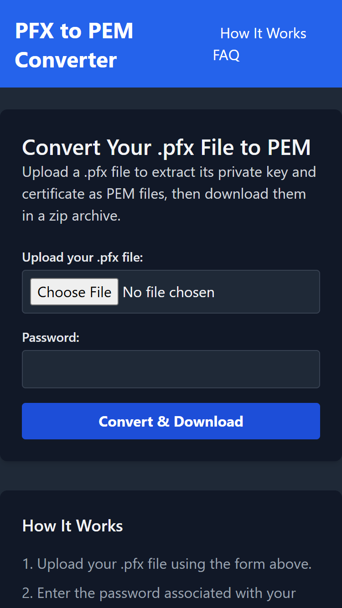
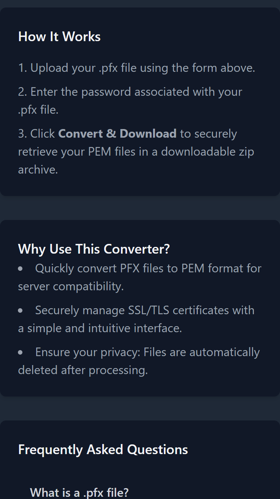
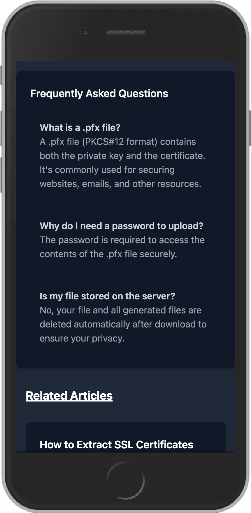

<div align="center">


# PFX to PEM Converter

**Convert PFX (PKCS#12) certificates to PEM, private key, and certificate files — securely, in your browser.**

[](https://pfx-to-pem-converter.shakiltech.com)
[](LICENSE)
[](https://www.php.net/)
[](https://tailwindcss.com/)
[](manifest.json)
[](https://github.com/itxshakil/pfx-to-pem-converter/actions/workflows/ci.yml)

[**Try it live →**](https://pfx-to-pem-converter.shakiltech.com)

</div>

---

A fast, privacy-first web tool for extracting SSL/TLS certificates from a `.pfx` / `.p12` (PKCS#12) bundle. Upload a PFX file, enter its password, and download the private key and certificate as PEM files in a single ZIP archive. Uploaded files are deleted the moment processing finishes — nothing is stored.

## Screenshots

| Home | How it works | FAQ |
| --- | --- | --- |
|  |  |  |

## Features

- **PFX → PEM conversion** — extracts the private key and certificate from a PKCS#12 bundle into standard PEM format.
- **Password-protected files** — decrypts encrypted `.pfx` / `.p12` files using the password you supply.
- **One-click ZIP download** — packages the extracted key and certificate into a single archive.
- **Privacy by design** — files are processed in a temporary directory outside the web root and deleted immediately after conversion. No file is ever persisted.
- **Hardened by default** — per-request Content-Security-Policy with nonces, CSRF protection using timing-safe comparison, and strict file validation.
- **Installable PWA** — works offline for the static shell and can be installed as an app.
- **Built-in SSL guides** — a small library of articles on extracting certificates, certificate chains, SSL vs TLS, renewal, and Apache installation.

## How It Works

1. **Upload** your `.pfx` / `.p12` file.
2. **Enter the password** that protects the bundle.
3. **Download** a ZIP containing your private key and certificate in PEM format.

Conversion is handled server-side by PHP's `openssl_pkcs12_read`, and every uploaded file is removed via a shutdown handler as soon as the request completes.

## Tech Stack

- **PHP 8.2+** — server-rendered, no framework. Uses the `openssl` and `zip` extensions.
- **Tailwind CSS 3** — token-driven design system with light/dark support.
- **Vanilla JavaScript** — progressive enhancement, no client framework.
- **Service Worker + Web App Manifest** — offline support and installability.

There are **no Composer dependencies** — the only build tooling is npm + Tailwind for compiling CSS.

## Getting Started

### Prerequisites

- [PHP](https://www.php.net/) **8.2 or later** with the `openssl` and `zip` extensions enabled
- [Node.js](https://nodejs.org/) **18+** and npm (only needed to rebuild the CSS)

### Run locally

```bash
# 1. Clone
git clone https://github.com/itxshakil/pfx-to-pem-converter.git
cd pfx-to-pem-converter

# 2. Install front-end tooling and build the CSS
npm install
npm run build        # or: npm run watch  (rebuild on change)

# 3. Serve with PHP's built-in server
php -S 127.0.0.1:8000
```

Then open <http://127.0.0.1:8000> in your browser. Any PHP-capable web server (Apache, Nginx, or [Laravel Herd](https://herd.laravel.com/)) works too — just point the document root at the project directory.

## Project Structure

```
.
├── index.php            # Converter UI (home page)
├── process.php          # Handles upload, conversion, ZIP download
├── partials/            # Shared head, header, footer, icon sprite
├── blogs/               # SSL/TLS guide articles
├── resources/css/       # Tailwind source
├── css/                 # Compiled CSS output
├── js/app.js            # Front-end interactions
├── sw.js, manifest.json # PWA service worker + manifest
└── images/              # Logo, icons, screenshots
```

## Security

Security is the whole point of this project, so it ships hardened:

- **No file retention** — uploads land in a `0700` temp directory outside the web root and are deleted on shutdown.
- **CSRF protection** — tokens validated with `hash_equals` (timing-safe).
- **Content-Security-Policy** — strict, per-request nonce on inline scripts; no inline event handlers.
- **Input validation** — only `.pfx` / `.p12` uploads are accepted.

Found a vulnerability? Please see [SECURITY.md](SECURITY.md) for responsible disclosure.

## Contributing

Contributions are welcome! Read [CONTRIBUTING.md](CONTRIBUTING.md) for setup, code style, and the pull-request process. For bugs and feature ideas, open an [issue](https://github.com/itxshakil/pfx-to-pem-converter/issues).

## License

Released under the [MIT License](LICENSE).

## Author

Built by **Shakil Alam** — [shakiltech.com](https://shakiltech.com) · [@itxshakil](https://github.com/itxshakil)

If this tool saved you time, a ⭐ on the repo is appreciated.
